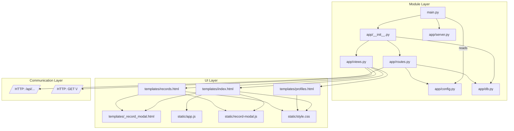

<!--
Synced context header from context.md
CTX_MAIN_TOPIC: SSH Log Tools
CTX_PROFILE: dev
CTX_LANG: en
CTX_DIAGRAM_STYLE: default
CTX_MERMAID_THEME: neutral
CTX_PRIORITY_MODE: recent-first
-->

# Module Architecture (Mermaid Graph)

## Imports and Layers

## Tag Mapping (Examples)
- module.entry — main.py
- module.api.routes — app/routes.py
- module.db — app/db.py (SQLite init and access)
- config.host, config.port — config.json
- logs.names, logs.paths — config.json
- computation.tail.block_size — routes.py (tail implementation)

Keep this graph updated when imports or boundaries change.
