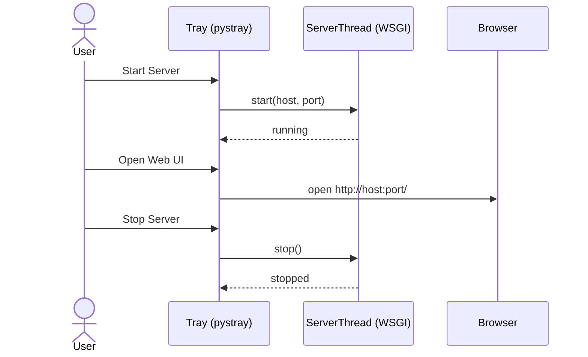
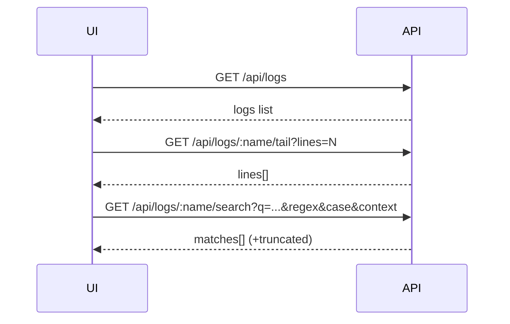

<!--
Synced context header from context.md
CTX_MAIN_TOPIC: SSH Log Tools
CTX_PROFILE: dev
CTX_LANG: en
CTX_DIAGRAM_STYLE: default
CTX_MERMAID_THEME: neutral
CTX_PRIORITY_MODE: recent-first
-->

# Sections, Flows, and Knowledge Base

This document captures the major operational sections, step-by-step flows, and supporting knowledge used by the system.

## Tray Lifecycle


## API Contracts
- GET `/api/logs`
  - Returns: `{ host, port, logs: [{ name, path, exists, size, mtime }], ts }`
- GET `/api/logs/<name>/tail?lines=N`
  - Returns: `{ name, lines: ["..."] }`
- GET `/api/logs/<name>/search?q=...&regex=0|1&case=0|1&context=K&limit=L`
  - Returns: `{ name, matches: [{ line, text, context_before }], truncated }`
- GET `/api/logs/<name>/download`
  - Sends the file as an attachment.

### Profiles API
- GET `/api/profiles` — list profiles
- POST `/api/profiles` — create profile `{ name, protocol=ssh|ftp, host, port, username, password }`
- PUT `/api/profiles/<id>` — update profile fields
- DELETE `/api/profiles/<id>` — delete profile
- GET `/api/profiles/<id>/paths` — list registered paths `[ { id, path, grep_chain[], cmd_suffix } ]`
- POST `/api/profiles/<id>/paths` — add path `{ path, grep_chain[], cmd_suffix? }` (path may include `| grep PAT` segments; trailing segment becomes cmd_suffix)
- PUT `/api/profile_paths/<ppid>` — update `{ path? , grep_chain? , cmd_suffix? }` (auto-splits `| grep` into grep_chain and captures cmd_suffix)
- DELETE `/api/profile_paths/<ppid>` — delete path
- GET `/api/profiles/<id>/cat?pattern=&grep=&cmd_suffix=&lines=N` — remote tail last N lines (+optional grep/suffix), returns `{ lines[] }`
- GET `/api/profiles/<id>/list?pattern=&type=auto|text|image&cmd_suffix=&limit=N` — expand glob to files (filters by type, optional suffix)
- GET `/api/profiles/<id>/ping` — connectivity check `{ ok, error? }`
- GET `/api/profiles/<id>/ftp/list?path=/` — list FTP directory

### Records API
- POST `/api/records` — create `{ profile_id?, title?, file_path?, filter?, content, situation?, event_time?, description? }`
- GET `/api/records` — list records with images
- PUT `/api/records/<id>` — update title/situation/description/event_time
- DELETE `/api/records/<id>` — delete record
- POST `/api/records/<id>/image` — upload image (multipart form-data `file`)
- POST `/api/records/<id>/image_remote` — fetch/attach remote image via SFTP (cached)
- DELETE `/record_images/<iid>` — delete image

## Log Tail Algorithm
Goal: efficiently read the last N lines without loading the entire file.

Steps:
1) Seek to end; read backwards in fixed-size blocks (default 1024 bytes).
2) Accumulate until line breaks cover N lines.
3) Decode, split, and take the last N lines.

Trade-offs:
- Fast for large files; small memory footprint.
- If lines are exceptionally long, may read more blocks.

## Search Algorithm
```mermaid
flowchart TD
  A[Open file (utf-8, replace errors)] --> B{Query set?}
  B -- No --> C[Match all]
  B -- Yes --> D{regex?}
  D -- Yes --> E[compile regex (opt: IGNORECASE)]
  D -- No --> F[substring compare (opt: lower)]
  E --> G[scan lines; collect matches]
  F --> G
  G --> H[Keep K context_before lines]
  H --> I{Reached limit L?}
  I -- Yes --> J[Stop; truncated=true]
  I -- No --> K[Continue]
```

Defaults (see docs/datatag.md):
- search.limit.default = 5000
- search.context.default = 0

## UI Flow


## Knowledge Base
- Paths: Windows vs Linux paths may appear in the same config.json; existence is reported per-host.
- Encoding: Files are read as UTF‑8 with `errors="replace"` to avoid crashes on mixed encodings.
- Security: No auth; app binds to `127.0.0.1` by default. Do not expose publicly without adding auth.
- Large files: Tail uses block reads; search streams lines to keep memory bounded.
- Images: Remote images are fetched via SFTP when recording and cached in memory (TTL + size budget) to reduce repeated downloads.
